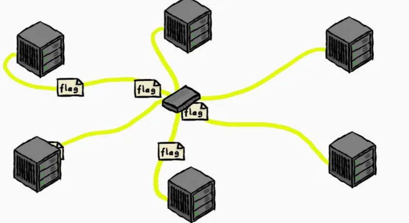
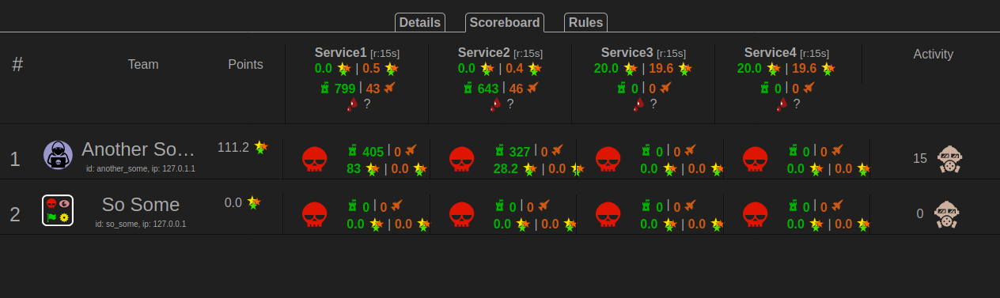
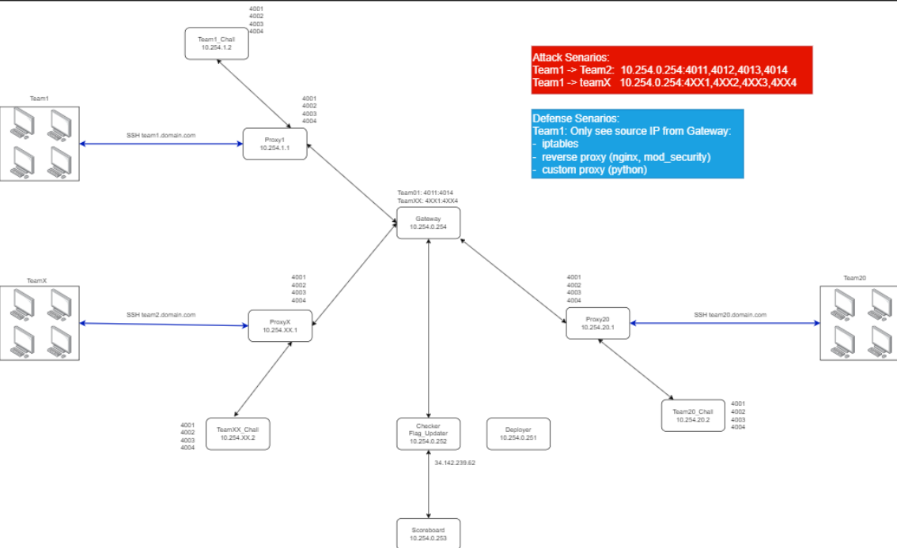

# Mục lục
[1. Giới thiệu về CTF attack defense](#1-giới-thiệu-về-ctf-attack-defense)

[2. Cách thức thi đấu](#2-cách-thức-thi-đấu)

[3. Các hình thức thi atk-def mà đã từng xuất hiện trong các cuộc thi SVATTT](#3-các-hình-thức-thi-atk-def-mà-đã-từng-xuất-hiện-trong-các-cuộc-thi-svattt)

- [Chung khảo 2023](#31-hình-thức-thi-atk-def-chung-khảo-2023)

- [Chung khảo 2024](#32-hình-thức-thi-atk-def-chung-khảo-2024)

- [Cách thức thi của MSEC](#cách-thức-thi-của-msec)

[4. Một số bài mẫu về cuộc thi atk-def](#4-một-số-bài-mẫu-về-cuộc-thi-atk-def)

[5. Một số kinh nghiệm và bài viết đáng chú ý](#5-một-số-kinh-nghiệm-và-bài-viết-đáng-chú-ý)
# 1. Giới thiệu về CTF attack defense
CTF (Capture The Flag) là một hình thức thi đấu an toàn thông tin mô phỏng các tình huống thực tế, trong đó người chơi hoặc đội chơi thực hiện các thử thách liên quan đến tấn công và phòng thủ hệ thống mạng. Trong số các loại hình CTF phổ biến như Jeopardy, Attack-Defense và Hybrid, CTF Attack-Defense được xem là hình thức thực chiến và thách thức nhất, phù hợp cho những người muốn thử sức trong các tình huống gần với thực tế.

## CTF Attack-Defense là gì?
CTF Attack-Defense là một cuộc thi mà các đội vừa phải bảo vệ hệ thống của mình, vừa cố gắng tấn công hệ thống của đội đối thủ. Mỗi đội thường được cung cấp một môi trường hệ thống riêng biệt bao gồm:  
- Các dịch vụ (services) hoặc ứng dụng dễ bị tấn công.
- Điểm số: Được tính dựa trên khả năng bảo vệ dịch vụ (defense points) và khai thác thành công hệ thống của đối thủ (attack points).
Mô phỏng hệ thống atk def, mỗi đội sẽ được cung cấp một hệ thống riêng có thể kết nối đến nhau bằng router chung


Ví dụ bảng dashboard của một cuộc thi atk-def ctf


---

# 2. Cách thức thi đấu
Trong CTF Attack-Defense, các đội tham gia sẽ hoạt động đồng thời ở hai vai trò:

- Attacker: Tìm kiếm và khai thác lỗ hổng trong các hệ thống của đối thủ để đánh cắp cờ (flag).
- Defender: Phát hiện, vá lỗi, và bảo vệ hệ thống của đội mình nhằm ngăn chặn các cuộc tấn công từ các đội khác.

Các hoạt động thường diễn ra trong thời gian thực, yêu cầu đội ngũ có khả năng phối hợp nhịp nhàng giữa tấn công và phòng thủ.

---

# 3. Các hình thức thi atk-def mà đã từng xuất hiện trong các cuộc thi SVATTT

Đặc điểm chung các kiểu thi atk-def hầu hết đều giống nhau, các thử thách thường sẽ là mảng pwn và web yêu cầu người chơi cần có kiến thức sâu về 2 mảng này. Chủ yếu điểm khác nhau ở các cuộc thi sẽ là về cách thức triển khai mạng và luật đối với người chơi. Dưới đây là 2 hình thức thi atk-def đã từng xuất hiện trong cuộc thi SVATTT

### 3.1. Hình thức thi atk-def chung khảo 2023
- Thể thức: Các đội thi cố gắng bảo vệ các hệ thống của mình khỏi các cuộc tấn
công từ các đội khác đồng thời cố gắng tấn công và kiếm điểm từ các hệ thống
của đối thủ.
- Website thi: https://final.ascis.vn
- Hệ thống lab: nằm trên hạ tầng cloud của BTC và được bàn giao cho các đội
khi bắt đầu vòng thi.
- Tài khoản thi: Tài khoản thi được BTC bàn giao cho các đội khi bắt đầu vào
vòng thi.
- Bảng dịch vụ: Bảng mô tả các dịch vụ hệ thống sẽ được gửi cho các đội trước
vòng thi.
- Mô hình mạng của vòng thi:


    - Gateway: một máy tính làm vai trò trung gian, nhận request từ tất cả
các đội chơi và forward dữ liệu tới máy chủ tương ứng
    - Proxy: Máy tính mà các đội chơi được quyền đặt các luật chặn, lọc dữ
liệu. Các đội chơi được quản lý toàn quyền cho một máy proxy.
    - Challenge: Các đội chơi không được quản lý máy chủ này. Các đội
chơi có thể cầm 1 máy chủ mẫu để tìm lỗi trên đó.

- Cách thức tấn công: Các đội chơi gửi request tới dịch vụ tương ứng của đội
bạn. Cổng dịch vụ của đội bạn tương ứng như sau:
    - Quy tắc như sau: cổng dịch vụ 4{id_của đội_chơi}{id_của_challenge}
    - Ví dụ, để tấn công vào dịch vụ số 1 của đội 01 thì gửi request tới:10.254.0.254:4011. Request sẽ đi từ gateway tới proxy của đội bị tấn công, tương ứng là cổng 4001 trên proxy. Nếu không chặn lọc gì, dữ liệu từ proxy lại đi tiếp đến cổng 4001 của ứng dụng đội 1.
    - Bảng phụ lục sẽ chứa thông tin cổng cụ thể cho từng dịch vụ của từng đội
    - Cờ sẽ được BTC thay đổi mỗi 15 phút
- Cách thức phòng thủ:
    - Các đội cầm proxy và thực hiện filter trên cổng tương ứng để chặn lọc
các dữ liệu nguy hiểm. Nếu bot của ban tổ chức không kiểm tra được
trạng thái của đội chơi, đội chơi sẽ mất điểm defend.
    - Dịch vụ sẽ được ban tổ chức kiểm tra thường xuyên và không báo trước
    - Các đội phải bảo vệ dịch vụ của đội mình

---

#### Cách thức thi của MSEC

Năm đó MSEC chơi chiến thuật chủ yếu là phòng thủ phản công, do chưa có kinh nghiệm nhiều nên các hệ thống giám sát còn rất hạn chế.

- Phòng thủ 

- Tường lửa **pfsense** các thành viên nhận thấy trên máy proxy đã cài sẵn nhiều luật để có thể thông giữa máy chứa challenge và các máy khác nên việc thay đổi luật trên pfsense là rất hạn chế. Do nếu không cẩn thận có thể làm dịch vụ bị disconnect dẫn tới bị checker trừ điểm rất nặng. Nhưng để phục vụ công cụ chặn bắt tấn công simple portforwarder các thành viên đã viết luật trong cuộc thi như sau:

```
# Generated by iptables-save v1.8.7 on Sat Oct 28 07:01:50 2023
*security
:INPUT ACCEPT [0:0]
:FORWARD ACCEPT [0:0]
:OUTPUT ACCEPT [11594:1079266]
-A OUTPUT -d 168.63.129.16/32 -p tcp -m tcp --dport 53 -j ACCEPT
-A OUTPUT -d 168.63.129.16/32 -p tcp -m owner --uid-owner 0 -j ACCEPT
-A OUTPUT -d 168.63.129.16/32 -p tcp -m conntrack --ctstate INVALID,NEW -j DROP
COMMIT
# Completed on Sat Oct 28 07:01:50 2023
# Generated by iptables-save v1.8.7 on Sat Oct 28 07:01:50 2023
*nat
:PREROUTING ACCEPT [0:0]
:INPUT ACCEPT [0:0]
:OUTPUT ACCEPT [0:0]
:POSTROUTING ACCEPT [0:0]
-A PREROUTING -p tcp -m tcp --dport 8001 -j DNAT --to-destination 172.16.0.250:10301
-A PREROUTING -p tcp -m tcp --dport 8002 -j DNAT --to-destination 172.16.0.250:10302
-A PREROUTING -p tcp -m tcp --dport 8003 -j DNAT --to-destination 172.16.0.250:10303
-A PREROUTING -p tcp -m tcp --dport 8004 -j DNAT --to-destination 172.16.0.250:10304
-A PREROUTING -p tcp -m tcp --dport 8005 -j DNAT --to-destination 172.16.0.250:10305
-A POSTROUTING -d 172.16.0.250/32 -p tcp -m tcp --dport 10301 -j MASQUERADE
-A POSTROUTING -d 172.16.0.250/32 -p tcp -m tcp --dport 10302 -j MASQUERADE
-A POSTROUTING -d 172.16.0.250/32 -p tcp -m tcp --dport 10303 -j MASQUERADE
-A POSTROUTING -d 172.16.0.250/32 -p tcp -m tcp --dport 10304 -j MASQUERADE
-A POSTROUTING -d 172.16.0.250/32 -p tcp -m tcp --dport 10305 -j MASQUERADE
COMMIT
# Completed on Sat Oct 28 07:01:50 2023
``` 
Một số command hữu ích
Lệnh xóa rules routing nat
```
sudo iptables -t nat -D PREROUTING 1
```
Xem rules routing nat
```
sudo iptables -L PREROUTING -t nat 
```
Xuất cấu hình iptables <Phải thực hiện ngay khi có quyền truy cập proxy>
```
sudo iptables-save > out.rules
```
Khôi phục cấu hình
```
sudo iptables-restore < out.rules
```


- Simple-portforwarder là tool sử dụng để chuyển cổng gôc scuar dịch vụ sang một cổng khác sau đó forward dữ liệu từ cổng gốc sang. Điều này có tác dụng làm cho ứng dụng này như một proxy thu nhỏ, mình có thể dễ dàng filter trên ứng dụng này. trogn cuộc thi thực tế các thành viên đã sử dụng 4 màn hình để bật 4 công cụ simple portforwarder cho 4 challenge và filter nếu flag bị lấy ra khỏi challenge gửi cho team khác.

Link: https://github.com/Q5Ca/simple-portforwarder

Config 
```
{
    "id": "web01",
    "local_port": "8080",
    "remote_host": "172.17.0.2",
    "remote_port": "80",
    "filter_request":{
        "string": [
            {
                "sign":"test",
                "action": 0
            }
        ],
        "hex": [
            {
                "sign": "616263",
                "action": 1
            }
        ],
        "regex": 
        [
            {
                "sign": "User-Agent:[ ]sqlmap",
                "action": 1
            }
        ]
    },
    "filter_response":{
        "string": 
        [
            {
                "sign": "SVATTT",
                "action" : "HTTP/1.1 400 Bad Request\r\nDate: Thu, 28 Nov 2019 12:52:08 GMT\r\nServer: Apache/2.4.29 (Ubuntu)\r\nContent-Length: 6\r\nConnection: close\r\nContent-Type: text/html; Charset=iso-8859-1\r\n\r\nconcac"
            }
        ],
        "hex": [],
        "regex": []
    }
}
```

- Tmux (viết tắt của Terminal Multiplexer) là một công cụ mạnh mẽ dùng để quản lý các phiên làm việc trong terminal. Nó cho phép người dùng tạo, quản lý, và điều khiển nhiều phiên làm việc (session) trong cùng một cửa sổ terminal hoặc trên nhiều máy từ xa mà không cần phải mở thêm các cửa sổ mới. Trong CTF atk-def thời lượng làm việc trên terminal ssh chiếm phần lớn thời gian, nên để tối ưng và ổn định các thành viên đã sử dụng công cụ tmux này.

- Tính năng chính của Tmux
    - Quản lý phiên làm việc (session management): Các phiên có thể được gắn (attach) hoặc tách (detach) bất kỳ lúc nào mà không làm gián đoạn công việc.
    - Phân chia màn hình (pane splitting): Cho phép chia màn hình thành nhiều phần (pane), mỗi phần chạy một tiến trình khác nhau. Hỗ trợ các kiểu chia ngang (horizontal) và chia dọc (vertical).
    - Tái kết nối phiên làm việc (persistent sessions): Phiên làm việc của Tmux có thể tiếp tục hoạt động ngay cả khi kết nối mạng bị mất hoặc terminal bị đóng.

Khởi động và quản lý phiên làm việc
---
| Lệnh | Miêu tả|
| ---- | ---------------- |
|tmux|	Bắt đầu một phiên Tmux mới.|
|tmux new -s <tên-phiên> |	Tạo một phiên mới với tên chỉ định.|
|tmux ls	|Liệt kê tất cả các phiên Tmux đang chạy.|
|tmux attach -t <tên-phiên>	| Kết nối lại vào một phiên đang chạy.|
|tmux detach|	Tách khỏi phiên hiện tại (hoặc dùng Ctrl-b d).|
|tmux kill-session -t <tên-phiên>|	Đóng một phiên cụ thể.|
|tmux kill-server|	Đóng tất cả các phiên Tmux.|

Quản lý cửa sổ (Windows)

|Tổ hợp phím|	Miêu tả|
| --- | --- |
Ctrl-b c	|Tạo một cửa sổ mới.
Ctrl-b n	|Chuyển đến cửa sổ tiếp theo.
Ctrl-b p	|Quay lại cửa sổ trước đó.
Ctrl-b 0...9	|Chuyển đến cửa sổ cụ thể theo số.
Ctrl-b w	|Hiển thị danh sách các cửa sổ và chuyển đổi.
Ctrl-b ,	|Đổi tên cửa sổ hiện tại.
Ctrl-b &	|Đóng cửa sổ hiện tại.

Quản lý các ngăn (Panes)

|Tổ hợp phím	|Miêu tả|
| --- | --- |
Ctrl-b %	|Chia dọc màn hình (pane dọc).
Ctrl-b "	|Chia ngang màn hình (pane ngang).
Ctrl-b o	|Chuyển đổi giữa các pane.
Ctrl-b x	|Đóng pane hiện tại.
Ctrl-b z	|Phóng to hoặc thu nhỏ pane hiện tại.
Ctrl-b q	|Hiển thị số thứ tự của các pane.
Ctrl-b {	|Di chuyển pane sang trái.
Ctrl-b }	|Di chuyển pane sang phải.
Ctrl-b :resize-pane -L	|Thu nhỏ pane sang trái.
Ctrl-b :resize-pane -R	|Mở rộng pane sang phải.
Ctrl-b :resize-pane -U	|Thu nhỏ pane lên trên.
Ctrl-b :resize-pane -D	|Mở rộng pane xuống dưới.

Copy và Paste (Copy Mode)

|Tổ hợp phím	|Miêu tả|
| --- | --- |
Ctrl-b [	|Bắt đầu chế độ sao chép (copy mode).
Ctrl-b ]	|Dán nội dung đã sao chép.
Space	|Bắt đầu đánh dấu văn bản trong copy mode.
Enter	|Kết thúc đánh dấu và sao chép vào clipboard của Tmux.
q	|Thoát chế độ copy mode.

Cấu hình và điều chỉnh

| Lệnh|	Miêu tả|
| --- | --- |
tmux source-file ~/.tmux.conf|	Nạp lại file cấu hình Tmux.
tmux set-option -g mouse on|	Bật chế độ hỗ trợ chuột.
tmux set-option -g prefix C-a	|Đổi phím tiền tố mặc định từ Ctrl-b thành Ctrl-a.

Tùy chỉnh file cấu hình
Lưu các thiết lập tùy chỉnh trong file ~/.tmux.conf, ví dụ:

```
# Thay đổi phím tiền tố
set-option -g prefix C-a
unbind C-b
bind C-a send-prefix

# Bật chế độ chuột
set-option -g mouse on

# Đặt thời gian hiển thị thông báo
set-option -g display-time 3000
```
Sau khi chỉnh sửa, dùng lệnh sau để áp dụng:
```
tmux source-file ~/.tmux.conf
```

- Tấn công
Do chiến thuật là phòng thủ phản công nên ngay hki có được request từ đội bạn và thấy flag được lấy ra từ log simple port forwarder các thành viên sẽ cố gắng tài tạo lại request và gửi ra tất cả các proxy còn lại

- Ví dụ autoFarm.sh đã được sử dụng

```
#!/bin/bash

flags=()

# Kiểm tra nếu có ít hơn 3 tham số đầu vào
if [ "$#" -lt 3 ]; then
    echo "Usage: $0 IP_CHECKER TEAM_TOKEN SERVICE_ID"
    exit 1
fi

# Gán các tham số vào biến
IP_CHECKER=$1
TEAM_TOKEN=$2
SERVICE_ID=$3

submit_flag() {
    local command="$1"
    eval "$command" > /dev/null 2>&1
    local status=$?
    echo "run command submit: " $command
    if [ $status -eq 0 ]; then
        echo "Submit flag successfully!"
    else
        echo "Failed submit."
        echo "$stderr"
    fi
}

get_flag() {
    local command="$1"
    local output
    output=$(eval "$command" 2>&1)
    local status=$?
    if [ $status -eq 0 ]; then
        local flag=$(echo "$output" | grep -oP 'TEAM00[0-9]_[A-Z0-9]{32}') # flag format
        flags+=("$flag")
        echo "Get flag successfully! Flag : " $flag
    else
        echo "Failed get flags."
        echo "$output"
    fi
}

farm_flag() {
    local ip_checker=$1
    local team_token=$2
    local service_id=$3

    echo Start farm flag in enemy $enemy_ip with service $enemy_service_id

    # Đọc file flag_ids.json
    if [ ! -f "./flag_ids.json" ]; then
        echo "File flag_ids.json not found."
        exit 1
    fi

    # Đọc nội dung JSON từ flag_ids.json
    flag_ids_data=$(jq -c '.flag_ids' flag_ids.json)

    # Lặp qua từng team_id và team_data
    for team_data in $(echo "$flag_ids_data" | jq -c 'to_entries[]'); do
        team_id=$(echo "$team_data" | jq -r '.key')
        team_host=$(echo "$team_data" | jq -r '.value.host')
        team_flag_ids=$(echo "$team_data" | jq -c '.value.flag_ids[]?')
        echo "----------------------------------------------------------------------------------"
        if [ -n "$team_flag_ids" ]; then
            echo "Get $(echo "$team_flag_ids" | wc -l) flag_id from team $team_id with host $team_host:"
            for team_flag_id in $team_flag_ids; do
                echo "flag_id: $team_flag_id"
                command="/root/exploit.sh http $team_host $team_flag_id" # Command exploit
                echo "run command get flag: " $command 
                get_flag "$command"
            done
        else
            echo "Get 0 flag_id from team $team_id with host $team_host:"
        fi
    done 

    # Ghi mảng flags vào flags.json
    printf '%s\n' "${flags[@]}" | jq -R . | jq -s . > flags.json

    # Gửi dữ liệu flags.json bằng curl
    command="curl -s -H 'X-Team-Token: $team_token' -X PUT --data @flags.json http://$ip_checker/flags?service=$service_id" #submit flag
    submit_flag "$command"
}

# Hàm thực thi lệnh curl và lưu kết quả vào file flag_ids.json
fetch_flag_ids() {
    local ip_checker=$1
    local team_token=$2
    local service_id=$3
    local output_file="./flag_ids.json"

    echo "Fetching flag IDs from $ip_checker for service $service_id..."

    # Thực thi lệnh curl với các tham số và lưu kết quả vào file
    curl -s -H "X-Team-Token: $team_token" "http://$ip_checker/flag_ids?service=$service_id" -o $output_file #Command get-flag_ids

    # Kiểm tra nếu lệnh curl thành công
    if [ $? -eq 0 ]; then
        echo "Flag IDs fetched successfully and saved to $output_file."
    else
        echo "Failed to fetch flag IDs."
    fi
}

echo "----------------------------------------------------------------------------------"

# Gọi hàm fetch_flag_ids với các tham số từ dòng lệnh
fetch_flag_ids "$IP_CHECKER" "$TEAM_TOKEN" "$SERVICE_ID"

echo "----------------------------------------------------------------------------------"

farm_flag "$IP_CHECKER" "$TEAM_TOKEN" "$SERVICE_ID"
```

### 3.2. Hình thức thi atk-def chung khảo 2024

Năm này luật thi rất mơ hồ và không có mô hình mạng, dựa trên luật MSEC phác thảo mô hình mạng như sau:


Bảng điểm cuộc thi 


Hướng dẫn dành cho các đội tham gia cuộc thi CTF Attack-Defense – ASCIS 2024
1. Mục tiêu của Cuộc thi Attack-Defense
- Phòng thủ: Bảo vệ các dịch vụ mà bạn được giao từ việc bị đội đối thủ tấn công.
- Tấn công: Khai thác các lỗ hổng trên hệ thống của đội khác để chiếm cờ (flag).
- Điểm số: Bạn sẽ nhận được điểm cho việc giữ cờ của mình an toàn và tấn công chiếm cờ từ các đội khác.
2. Truy cập Hệ thống và Môi trường của Bạn
- Mỗi đội sẽ được cấp các máy ảo Docker riêng, nơi các dịch vụ đang chạy và cờ
được bảo vệ.
- Bạn sẽ được cung cấp tài khoản SSH “ctf” để đăng nhập vào máy ảo của mình
và thực hiện các hành động phòng thủ.
- Tài khoản “ctf”: Đây là tài khoản chính mà bạn sẽ sử dụng để truy cập, giám sát,
và bảo vệ hệ thống. Tuy nhiên, tài khoản này bị giới hạn quyền chỉnh sửa trên một số tập tin và
cấu hình hệ thống để đảm bảo tính công bằng.
- Cách đăng nhập vào máy ảo Docker của đội bạn:
        1. Sử dụng SSH để đăng nhập vào máy ảo của bạn: ssh ctf@[IP-máy-ảo]
        2. Nhập mật khẩu được cung cấp cho tài khoản ctf.
        3. Nhiệm vụ Phòng Thủ

Bảo vệ Dịch vụ và Flag:
- Bảo vệ dịch vụ: Dịch vụ của bạn có thể là một trang web, dịch vụ mạng hoặc cơ sở dữ liệu. Bạn cần giám sát và bảo vệ chúng khỏi các cuộc tấn công từ đội đối thủ. Đảm bảo rằng các dịch vụ này luôn hoạt động, không bị gián đoạn.
- Để kiểm tra trạng thái dịch vụ, bạn có thể sử dụng lệnh sau trong máy ảo:
service [tên dịch vụ] status
- Bảo vệ flag: Flag được đặt trong một tệp đặc biệt (thường là /flag/flag.txt). Đội
bạn cần bảo vệ cờ này để không bị đội khác lấy được.
Giới hạn của tài khoản “ctf”:
- Tài khoản “ctf” không có quyền truy cập hoặc thay đổi các tệp cấu hình hệ thống. Bạn
chỉ có thể chỉnh sửa các tập tin thuộc về dịch vụ mà bạn cần bảo vệ.
- Bạn có thể sửa đổi các tập tin cấu hình của dịch vụ và/hoặc hệ thống tường lửa (firewall) trong giới hạn được cho phép để bảo vệ các dịch vụ.

Một số hành động phòng thủ điển hình:
- Sửa chữa lỗ hổng: Tìm hiểu và khắc phục các lỗ hổng có thể bị khai thác trong dịch vụ của bạn (ví dụ vá lỗi cấu hình bảo mật, thay đổi cấu hình dịch vụ).
- Cấu hình tường lửa: Thiết lập các quy tắc tường lửa để bảo vệ dịch vụ khỏi các IP không đáng tin cậy (tuỳ theo yêu cầu của thử thách, bạn sẽ được cấp/không được cấp quyền
chỉnh sửa tường lửa).

4. Nhiệm vụ Tấn Công

Khai thác lỗ hổng của đội khác:
- Mục tiêu của bạn là tìm và khai thác các lỗ hổng trong dịch vụ của các đội đối thủ.
Khi khai thác thành công, bạn sẽ có thể lấy được flag của họ.
- Cờ mặc định được lưu trong tệp /flag/flag.txt trên máy ảo của đội khác, trừ khi có
các quy tắc đặc biệt khác.
Cách tiếp cận tấn công:
- Khai thác (Exploitation): Sử dụng các kỹ thuật tấn công dựa trên lỗ hổng của
dịch vụ (ví dụ như SQL Injection, Remote Code Execution).
- Chiếm flag: Sau khi khai thác thành công dịch vụ của đội khác, bạn sẽ tìm thấy flag trong tệp /flag/flag.txt. Lấy flag và gửi lên hệ thống để ghi điểm tấn công.

5. Hệ thống Thay Đổi Flag và Chấm Điểm
- Thay đổi flag tự động: Hệ thống sẽ thay đổi nội dung cờ (flag) sau mỗi khoảng
thời gian nhất định. Vì vậy, các đội phải liên tục tấn công và bảo vệ flag mới.
- Điểm phòng thủ: Dịch vụ của bạn phải luôn hoạt động và flag phải được bảo vệ.
Nếu dịch vụ của bạn bị ngừng hoặc bị tấn công, bạn sẽ bị trừ điểm.
- Điểm tấn công: Mỗi lần lấy được flag từ đội đối thủ, bạn sẽ nhận được điểm tấn
công.

6. Hạn chế và Quy tắc
- Không tắt dịch vụ: Nếu bạn tắt dịch vụ để ngăn đội khác tấn công, hệ thống sẽ phát hiện và bạn sẽ bị trừ điểm.
- Không phá hoại hệ thống: Không được cố tình phá hoại hoặc làm sập máy ảo của đội khác ngoài mục tiêu khai thác lỗ hổng để lấy flag.

--- 

# 4. Một số bài mẫu về cuộc thi atk-def

Dưới đây là một hệ thống thật về 1 cuộc thi atk-def có cả lời giải và hướng dẫn triển khai đầy đủ

https://github.com/HITB-CyberWeek/hitbsecconf-ctf-2023

# 5. Một số kinh nghiệm và bài viết đáng chú ý

- Cheetsheet về các tool của atk-def ctf chia sẻ về rất nhiều tool hay: https://hackmd.io/@Masamune/SyiHF1qcA?utm_source=preview-mode&utm_medium=rec#Log-tool

- Kinh nghiệm khi thi atk-def ctf:  https://medium.com/@iabdullah_215/my-guide-to-attack-and-defense-ctfs-ecbe838d49cd

