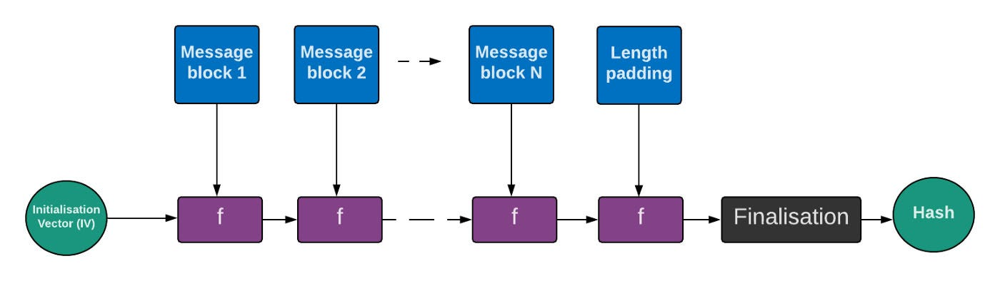

# Tổng hợp đề CTF

## 1. Công cụ
* [Sagemath](https://doc.sagemath.org/html/en/installation/index.html)
* [crypto-attacks](https://github.com/jvdsn/crypto-attacks.git)
* Python (chắc chắn rồi, làm crypto không thành thạo python thì nghỉ :>)

## Kiến thức nền
Trước khi bắt đầu học nên nắm một số kiến thức toán như sau (thực ra không nắm cũng được nhưng nên đọc qua để vào thi còn biết mà google :>):

* Toán tử bitwise: chủ yếu là xor, shift left, right
* Biến đổi số: (mod, mũ, gcd, định lý Euler nhỏ, định lý thặng dư Trung Hoa, đa thức, ... tạm thế đã)
* Đại số tuyến tính (ma trận, vector) cái này thì gặp khá nhiều, đặc biệt LLL (rất rất có ích)
* Tiếng Anh tốt một chút, nhiều bài chỉ cần biết keyword và google thì có sẵn code luôn

## Tutorial để làm quen
* Cryptohack: 
  * [Giải bài](https://cryptohack.org)
  * [Notebook cho lý thuyết](https://cryptohack.gitbook.io/cryptobook)

## 2. Dạng bài

### Toán

#### Đa thức nguyên trên trường mod(N)
Những bài như thế này thường cho 1 đa thức P trên trường mod N (nói dễ hiểu thì $P(x) \cong P(x+N)$), bắt tìm nghiệm -> giải ra flag

Ví dụ: ASCIS 2023 Crypto gym
* Bài cho 1 đa thức bậc 7 có nghiệm là flag trên trường $p^{100}$, $p$ là 1 số nguyên tố
* Cách giải: $p$ bé -> tìm nghiệm trên trường $p$, dùng bổ đề nâng Hensel để tìm nghiệm với $p^2, p^3, ..., p^{100}$

```python
from Crypto.Util.number import *

flag = b"ASCIS{W3llDone_hitting_the_crypto_gym}"
p = random_prime(2^64,False,2^63)
k = 100
N = p^k
R.<x> = PolynomialRing(Zmod(N), implementation="NTL")

pol = R([getrandbits(303) for _ in range(8)])
rem = pol(bytes_to_long(flag))
pol2 = pol - rem

print(p)
print(pol2)
```

#### PRNG
Cho hệ sinh ngẫu nhiên (thường là [LCG](https://en.wikipedia.org/wiki/Linear_congruential_generator), [LFSR](https://en.wikipedia.org/wiki/Linear-feedback_shift_register), ...) nếu dễ thì cho nguyên hệ và các tham số, hoặc khó hơn thì sẽ giấu đi 1 phần tham số hệ sinh hoặc giấu đi 1 phần trạng thái ngẫu nhiên ([truncated LCG](https://github.com/jvdsn/crypto-attacks/tree/master/attacks/lcg))

Ví dụ: ASCIS 2023 I don't know how to name this chall
* Bài này gồm 2 phần, giải ra 1 hệ truncated LCG và giải hệ RSA
* Để giải hệ truncated LCG: bài cho 2 hệ LCG biết a, c, m; nhưng mỗi số ngẫu nhiên sinh ra chỉ biết 18 và 20 bits đầu tiên 
* [Script giải](https://github.com/jvdsn/crypto-attacks/blob/master/attacks/lcg/truncated_state_recovery.py) (trong link có recovery state và parameter, ở đây đã biết parameter tức là a, c, m thì cần recovery state)

```python
from Crypto.Random.random import getrandbits
from Crypto.Util.number import bytes_to_long
from sympy import *
nbits = 128
while True:
    mul = getrandbits(nbits)
    add = getrandbits(nbits)
    modulus = getrandbits(nbits)
    if mul < modulus and add < modulus:
        break

def gen_num(bits):
    truncate = bits
    seed = getrandbits(511)
    gen_num = 41

    xx = []
    yy = [] 
    
    for _ in range(gen_num):
        seed = (mul * seed + add) % modulus
        xx.append(seed)
        yy.append(seed >> (nbits-truncate))
    return xx, yy

_, ee = gen_num(18)
_, ff = gen_num(20)

a = ee[-1]
b = ff[-1]
c = getrandbits(1024)
p = nextprime(a * c + getrandbits(512))
q = nextprime(b * c + getrandbits(512))

flag = '<REDACTED>'
N = p * q
e = 65537
m = bytes_to_long(flag.encode())
enc = pow(m, e, N)

print(f'enc = {enc}')
print(f'N = {N}')
print(f'ee = {ee[:-1]}')
print(f'ff = {ff[:-1]}')
print(f'a = {mul}')
print(f'c = {add}')
print(f'm = {modulus}')
```

#### Khác

ASCIS 2024 Close:
* Bài cho p, q1->4 là 5 số nguyên tố, N1->4 = p*q1->4 + err
* Để giải thì cần tìm được ít nhất 1 trong 5 số nguyên tố kia là xong
* Theo suy nghĩ thông thường nếu không có phần err cộng thêm kia thì p = gcd(N1->4)
* Như vậy sẽ phải đi tìm xấp xỉ gcd của N1->4 mà bài cho, đây là bài toán approximate common divisor
* [Script giải](https://github.com/jvdsn/crypto-attacks/blob/master/attacks/acd/ol.py)

```python
from Crypto.Util.number import getPrime, bytes_to_long
import random
import os

e = 65537
p = getPrime(1024)
while (p - 1) % e == 0:
    p = getPrime(1024)

Ns = []
while len(Ns) < 4:
    q = getPrime(2048)
    N = p * q
    if (q - 1) % e != 0 and N not in Ns:
        Ns.append(N)

flag = open("flag.txt", "rb").read()
flag += os.urandom(3072 // 8 - 2 - len(flag))
flag = bytes_to_long(flag)

cts = [pow(flag, e, N) for N in Ns]
Ns = [N + int(os.urandom(32).hex(), 16) for N in Ns]
random.shuffle(Ns)

f = open("output.txt", "w")
f.write(f"{Ns = }\n")
f.write(f"{cts = }\n")
f.close()
```

DUCTF 2024 V for Vieta
* Đây là 1 bài khá là vui vẻ
* Đầu tiên là tên bài V for Vieta, khả năng Vieta chính là cái định lý Vieta nói về công thức giữa nghiệm và hệ số của đa thức ấy
* Tiếp đến là cài đặt của server:
  * $a^2 + b^2 + ab = k(2ab + 1) (1)$ trong $k=l^2$
* Thử tìm 1 nghiệm xem nó như thế nào, thử bỏ biến độc lập $b$ bằng cách $b^2 = k$
* Dễ thấy có 1 nghiệm $b = l; a = 2l^3 - l$
* Như đã nói trên, dùng định lý Vieta xét $a > b$:
  * $b^2 - b(2ka-1) + ab - k + b^2 = 0 (2)$
* Nếu $b$ là nghiệm thì $2ka - 1 - b$ cũng là nghiệm
* Tức là nếu $a, b$ là nghiệm của $(1)$ thì $2ka - 1 - b, a$ cũng là nghiệm của $(1)$
* Bài này mình đưa ra để cho 1 hướng suy nghĩ khi làm bài và tìm kiếm thông tin liên quan; chứ chắc ko gặp lần 2 :>

```python
import os
import random
import json
from enum import Enum


FLAG = os.getenv("FLAG", "DUCTF{dummy_flag}")


class State(Enum):
    INITIAL = 1
    TEST = 2
    QUIT = 3


class Server:
    def __init__(self):
        self.level = 2048
        self.target = 2048
        self.finish = 8
        self.state = State.INITIAL

    def win(self):
        return {
            "flag": FLAG,
        }

    def generate_k(self):
        self.k = random.getrandbits(self.level) ** 2
        self.state = State.TEST
        return {
            "k": self.k,
            "level": self.level,
        }

    def test(self, challenge):
        a, b = challenge["a"], challenge["b"]
        if a <= 0 or b <= 0:
            self.state = State.QUIT
            return {"error": "Your answer must be positive!"}

        if a.bit_length() <= self.target or b.bit_length() <= self.target:
            self.state = State.QUIT
            return {"error": "Your answer is too small!"}

        num = a**2 + a * b + b**2
        denom = 2 * a * b + 1

        if num % denom != 0 or num // denom != self.k:
            self.state = State.QUIT
            return {"error": "Your answer wasn't a solution!"}

        self.level -= self.level // 5

        if self.level <= self.finish:
            self.state = State.QUIT
            return self.win()
        else:
            return self.generate_k()


def main():
    server = Server()
    print("V equals negative V plus or minus the squareroot of V squared minus 4 V V all divided by 2 V!")

    while True:
        if server.state == State.INITIAL:
            print(json.dumps(server.generate_k()))
        elif server.state == State.TEST:
            challenge = json.loads(input())
            print(json.dumps(server.test(challenge)))
        elif server.state == State.QUIT:
            exit(0)


if __name__ == "__main__":
    main()
```

## 3. Hash
Thường thì cái này nó sẽ là kĩ thuật trong 1 bài lớn hơn, dạng gặp nhiều nhất là bài cho kiểu gửi plaintext, trả về hash; để lấy flag thì phải gửi 1 cặp plaintext - hash và plaintext thoả mãn điều kiện gì đó (tất nhiên nếu gửi thẳng plaintext này cho server thì nó sẽ từ chối gửi mã hash), dạng này là hash length extension attack. Đặc điểm nhận dạng là biết được độ dài của salt hoặc private part thêm vào đầu.
Để dễ hiểu thì hàm hash hoạt động như sau:

Đặt hàm hash là $F(IV, plaintext)$. Khi hash có salt hoặc private part thì phần đấy được thêm vào đầu plaintext, ta biết được độ dài thì thấy ngay là $F(IV, padding(plaintext) || new message) = F(F(IV, plaintext), new message)$ (|| là nối chuỗi), tức là IV bằng hash đã biết trong cài đặt của hàm hash.
[Script khai thác](https://github.com/stephenbradshaw/hlextend)
Đến mã hoá đối xứng cũng có một dạng tương tự như thế này.

Ví dụ Buckeye 2024 Hashbrowns:
Message cho ban đầu không có "french fry" và message gửi lên phải có để lấy flag, chúng ta không biết secret nhưng biết độ dài của nó. Thực ra bài này mã hash cài đặt không giống các loại cơ bản như MD5, SHA nhưng nguyên lý cơ bản giống nhau. Cách giải thì đơn giản là tạo message mới: pad(message ban đầu) + "french fry", mã hash mới là hash(message mới) nhưng state là mã hash của message ban đầu.
```python
secret = os.urandom(16)

def hash(data: bytes):
    data = pad(data)
    state = bytes.fromhex("f7c51cbd3ca7fe29277ff750e762eb19")

    for i in range(0, len(data), 16):
        block = data[i : i + 16]
        state = aes(block, state)

    return state


def sign(message, secret):
    return hash(secret + message)


def main():
    print("Recipe for hashbrowns:")
    print(my_message)
    print("Hashbrowns recipe as hex:")
    print(my_message.hex())
    print("Signature:")
    print(sign(my_message, secret).hex())
    print()

    print("Give me recipe for french fry? (as hex)")
    your_message = bytes.fromhex(input("> "))
    print("Give me your signiature?")
    your_signiature = bytes.fromhex(input("> "))
    print()

    print("Your recipe:")
    print(your_message)
    print("Your signiature:")
    print(your_signiature.hex())
    print()

    if b"french fry" not in your_message:
        print("That is not a recipe for french fry!!")
    elif your_signiature != sign(your_message, secret):
        print("That is not a valid signiature!!")
    else:
        print("Thank you very much. Here is your flag:")
        print(flag)


if __name__ == "__main__":
    main()
```


## 4. Mã hoá bất đối xứng

### RSA
Quá kinh điển:
Một số các dạng dễ và dấu hiệu:
* Dạng dễ nhất là RSA với e bé và biết được ít nhất e bộ khoá pub, e bộ ciphertext: $m_i = plaintext^{e} \mod N_i, i=1,e$ thường $e=3$
* Nếu có $i, j; N_i \mod N_j \neq 0$ tìm được $p = gcd(N_i, N_j)$, dạng này không cần tới $e$ bộ
* Hoặc không thì dùng định lý thặng dư trung hoa:

```python
from sympy.ntheory.modular import crt
# N_list: List of moduli [N_1, N_2, ..., N_e]
# m_list: List of encrypted mesages [m_1, m_2, ..., m_e]
m = crt(N_list, m_list)
plaintext = int(pow(m, 1/e, product(N_list)))
```
* $p, q$ bé: dùng factordb là xong
* Wiener's Attack: khi d nhỏ (thường là d < N^0.25)
* Boneh-Durfee Attack: biến thể của Wiener's Attack, có thể phá khi d < N^0.292 
* Franklin-Reiter Related Message Attack: khi có 2 ciphertext của 2 plaintext có quan hệ đa thức với nhau
* Common Modulus Attack: khi cùng message được mã hóa với cùng N nhưng khác e
* Low Public Exponent Attack: e nhỏ và message không được padding
* Coppersmith Attack: dùng để tìm nghiệm của đa thức modulo khi biết một phần nghiệm
* Small Prime Attack: khi một trong các prime factors của N nhỏ
* Partial Key Exposure Attack: khi biết một phần của private key
* Broadcast Attack: khi cùng một message được gửi cho nhiều người dùng với cùng e

[Hướng dẫn cho những dạng trên](https://hackmd.io/@nhatviet/r1SLEfqua#Small-public-exponent)

### ECC
Cái này thì nên đọc qua, lý thuyết và bài của Cryptohack khá ổn, còn chall thật thì để tìm đã, à cái này có liên quan đến 1 số giao thức trao đổi khoá như Diffie - Hellman, cũng tìm đọc luôn.

### Lattice-based
Cái này khá là hay, đầu tiên phải hiểu một số khái niệm như vector, không gian và phần lý thuyết số phải nắm chắc. Quan trọng nhất, hiểu [LLL](https://en-m-wikipedia-org.translate.goog/wiki/Lenstra–Lenstra–Lovász_lattice_basis_reduction_algorithm?_x_tr_sl=en&_x_tr_tl=vi&_x_tr_hl=vi&_x_tr_pto=tc) (hiểu đơn giản nhất thì LLL tìm 1 hệ tuyến tính hệ số nguyên của các vector để tạo ra vector có độ dài bé nhất)
Một số dạng cơ bản:
Knapsack cipher: [link](https://drx.home.blog/2019/02/24/crypto-he-ma-merkle-hellman/#more-386)
NTRU cipher: [link](https://hackmd.io/@vishiswoz/ryDA_PGPo?utm_source=preview-mode&utm_medium=rec)

## 5. Mã hoá đối xứng
### AES
1 cái kinh điển khác
Ở đây mình sẽ liệt kê các stream mode của AES và 1 số đặc điểm có thể dùng để khai thác (ở đây 1 block có độ dài 16 bytes):
* AES-ECB
    - $Enc(padding(plaintext_1) || plaintext_2) = Enc(plaintext_1) + Enc(plaintext_1)$

    - Block $n+1$ của ciphertext có thể tính bằng cách key là encrypt chuỗi trong block từ $1$ đến $n$, và dùng AES-ECB encrypt block $n+1$ (để ý kĩ thì cái này tương tự hash length extension như trên)
* AES-CBC

* AES-CTR
    - $Enc(Enc(message)) = message$


...To be continued